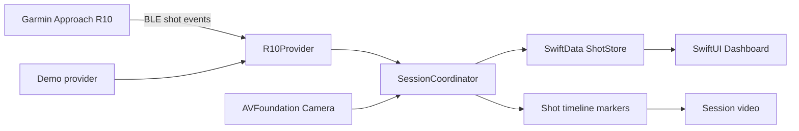

# Architecture

The R10 provider is isolated behind a protocol. Camera capture is isolated in `CameraRecorder`. `AppModel` coordinates sessions and persists each shot immediately. The MVP is local-first and works without a server.

Synchronization retains both R10 impact time and phone receipt time, plus the camera elapsed marker. A later calibration flow can estimate BLE/video offset using a visible sync marker.
